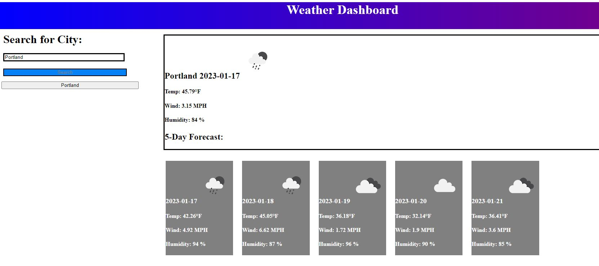
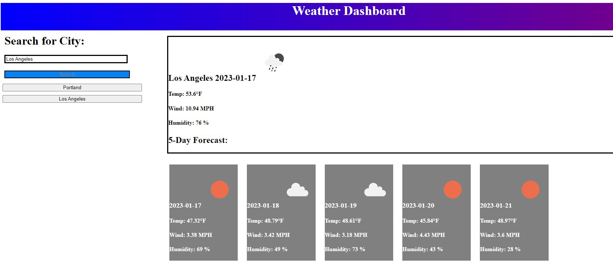

# Weather-Dashboard 1/11/2023

### Motivation
This project was created to function as a weather dashboard that logs a searched city's current weather along with the upcoming 5-Day Forecast.

### Build Status
Running as a GitHub Webpage

### Features
A basic webpage with weather api query and search funtcions. This webpage gathers the user's desired city and collects the corresponding data for the current weather along with the upcoming 5-Day Forecast. Information that is illustrated includes the date, current and upcoming temperatures, icon that depicts weather type, humidity, and wind speed. Once searched, a city is logged as a button to the left side to allow for backtracking between searches.

### Installation
N/A

### Project Preview

### How to Use
The webpage can be found on the following this link [here.](https://aguilarj5.github.io/Weather-Dashboard/)

### Credits
Coding Bootcamp
OpenWeather

### License
N/A
